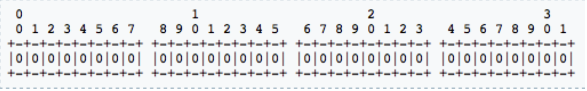
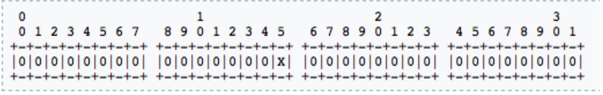

L'acheminement des demandes dans le cadre du dialogue est une partie assez réduite, car il n'y a pas de traitement complexe pour découvrir l'adresse du prochain saut, étant donné que la demande est acheminée par le mécanisme d'acheminement des enregistrements.
Le traitement commun des demandes consiste à : - bloc de routage [REQINIT]
- Blocage de l'itinéraire [NATDETECT]
- ANNULER le traitement
La fonctionnalité de cette partie est présentée dans le diagramme suivant :

Chacune de ces parties peut quitter le traitement du fichier de configuration, en arrêtant l'exécution à son niveau (par exemple, un message SIP cassé a été détecté par les contrôles de santé mentale).
CANCEL est géré dans cette partie en raison de certains dispositifs défectueux qui définissent le paramètre de balise d'en-tête To, ce qui les fait ressembler à une requête de dialogue within. Le CANCEL doit également être envoyé par le serveur SIP aux adresses où l'INVITE associé a été envoyé, information qui est stockée dans la transaction SIP et est utilisée directement par t_relay().
Le traitement des demandes dans le cadre d'un dialogue implique le traitement du routage des enregistrements et la comptabilisation de l'événement END des appels VoIP ou la gestion des demandes de dialogue pour le service de présence locale. Les règles de traitement NAT doivent également être appliquées aux demandes dans le cadre du dialogue. Dans cette section, nous nous occupons de l'ACK, qui peut être le corps du SDP, mais qui est transmis sans état (parce qu'il n'a pas de réponses), de sorte que la branche_route pour la traversée NAT n'est pas exécutée pour elle comme elle l'est pour les INVITÉS.
Une requête dans le dialogue est détectée par la présence de la valeur du paramètre de la balise d'en-tête To.
Les actions exécutées pour router les requêtes dans le dialogue sont regroupées dans le bloc route [WITHINDLG].

Il absorbe d'abord les retransmissions, puis procède à l'authentification et à l'autorisation (en route [AUTH]), enregistre le routage et marque les transactions pour la comptabilité. Il s'agit de règles de traitement communes pour les demandes initiales, à partir de là, les règles sont regroupées par type de service.
Ensuite, il y a la détection des services qui ne sont pas hébergés par cette instance Kamailio, en relayant les demandes vers les réseaux SIP étrangers sur la base du nom d'hôte DNS ou de l'adresse IP dans l'URI de la demande.
Seuls les services locaux sont ciblés après l'appel de route (SIPOUT). Parmi eux, le request_route commence à traiter les demandes qui se terminent sur cette instance de serveur SIP, respectivement les services de présence et de bureau d'enregistrement, dans la route [PRESENCE] et la route [REGISTRAR].
Les autres demandes SIP à traiter concernent les utilisateurs locaux ou les passerelles RTPC, il doit donc s'agir d'un nom d'utilisateur dans R-URI (qui est également l'extension composée pour les numéros RTPC).
route [PSTN] sélectionne les appels pour la passerelle RTPC sur la base d'une correspondance par expression régulière avec l'extension composée - elle doit commencer par "+" ou "00" et ne doit contenir que des chiffres. Vous pouvez ajuster la condition pour qu'elle corresponde à vos besoins. La connectivité RTPC n'est possible que si vous définissez une adresse IP de passerelle RTPC dans le paramètre global personnalisé "pstn.gw_ip".
Si les demandes ne concernent pas la passerelle RTPC, elles sont alors traitées par le service de localisation qui effectue la numérotation abrégée, les alias d'identité et la recherche de l'emplacement de l'utilisateur (en route [LOCATION]). Si l'utilisateur de destination n'est pas en ligne, il peut envoyer les appels à la messagerie vocale (si l'adresse du serveur de messagerie vocale est définie dans les paramètres globaux personnalisés).
Plus de détails sur les actions utilisées pour construire certaines des fonctionnalités du fichier de configuration par défaut sont présentés dans des sections dédiées plus loin dans ce livre, par exemple l'authentification de l'utilisateur, l'autorisation IP ou la traversée NAT.
Un bloc de sous-route est exécuté par le module xmlrpc lors de la réception d'une commande RPC. Par conséquent, les actions de ce bloc de route sont exécutées pour les requêtes HTTP, mais vous pouvez utiliser à l'intérieur de celui-ci la plupart des fonctions qui sont capables de traiter les requêtes SIP.
Le bloc branch_route [MANAGE_BRANCH] est utilisé pour la traversée NAT, pour engager le relais RTP via RTPProxy vers les branches sortantes des requêtes INVITE qui sont venues ou doivent passer par les routeurs NAT.
Le block reply_route [MANAGE_REPLY] a également pour rôle d'aider à la traversée NAT, en traitant les 180, 183 ou 200 réponses des INVITEs natted.
Le block reply_route [MANAGE_FAILURE] est utilisé pour détruire les sessions de relais RTP pour les INVITEs natted et présenter les exemples de remplacement des réponses de redirection 3xx et de renvoi d'appel vers le serveur de messagerie vocale en cas d'absence de réponse ou d'occupation de l'utilisateur.
Notez la présence de la déclaration IF qui vérifie si la transaction INVITE a été annulée par l'appelant :
923. 924. 925.
if (t_is_canceled()) { 
sortie ;
}
Il s'agit de saisir la situation lorsque l'appelant envoie un message d'ANNULATION avant que l'INVITE ne reçoive une réponse de 200 ok. L'effet de la demande d'ANNULATION est que l'INVITE reçoit

automatiquement une réponse 487, ce qui signifie que la transaction INVITE a échoué du point de vue du routage et que le bloc failure_route est exécuté pour elle.
Mais il est inutile d'essayer de réacheminer une INVITE qui a été annulée, car l'appelant est parti (si la nouvelle branche reçoit une réponse 200 OK, il y aura un appelé actif, mais pas d'appelant).
Assurez-vous de conserver cette condition dans chaque bloc failure_route où vous avez l'intention d'effectuer un réacheminement.

Le fichier de configuration par défaut est un très bon point de départ pour la plupart des déploiements impliquant Kamailio, les parties telles que le traitement initial, les demandes de routage au sein du dialogue ou l'authentification peuvent être facilement extraites et réutilisées.
Cependant, quelques exemples très simples peuvent aider à entrer dans la logique de la construction du fichier de configuration

## UN SIMPLE ÉQUILIBREUR DE CHARGE SANS ETAT

La logique de routage suivante est souhaitée :
- acheminer uniquement les demandes INVITE, pour le reste envoyer 404 non trouvé
- chaque processus Kamailio doit choisir la destination parmi deux adresses IP de manière circulaire
Chaque processus Kamailio doit stocker des informations sur le dernier serveur utilisé, pour les envoyer au suivant. Cela peut être fait en stockant l'index dans une variable de script stockant la valeur dans la mémoire privée :

              loadmodule “pv.so” 
              modparam("pv", "varset", "i=i:0") 
              request_route {
              if(!is_method(“INVITE”)) { 
              sl_send_reply(“404”, “Not Found”); exit;
              }
              $var(i) = ($var(i) + 1 ) mod 2; 
              if($var(i)==1) {
              rewritehostport(“1.2.3.4”); }
              else {
              rewritehostport(“2.3.4.5”); }
              forward(); 
              }

Le module pv est chargé pour pouvoir utiliser la pseudo-variable $var(i). Le paramètre varset du module est utilisé pour initialiser $var(i) à 0 (zéro) au démarrage (qui est la valeur initiale par défaut, mais il a été ajouté ici pour avoir un exemple explicite).
En fonction de la valeur de $var(i), le premier (1.2.3.4) ou le second (2.3.4.5) serveur sera utilisé pour la redirection. À chaque transfert, la valeur de $var(i) est incrémentée et une opération modulo 2 lui est appliquée pour rester dans la plage 0 ou 1.
La valeur de $var(i) est stockée en mémoire privée, elle est donc spécifique à chaque processus Kamailio. Elle persiste également lors du traitement de nombreuses requêtes SIP, n'étant pas attachée à une requête, mais faisant partie de l'environnement d'exécution.
Cet exemple construit un équilibreur de charge dans chaque processus de demande (souvenez-vous que Kamailio est une application multi-processus). Pour une politique d'équilibrage de charge round robin au niveau de l'instance de Kamailio, l'index du serveur à utiliser doit être conservé en mémoire partagée. Comme de nombreux processus peuvent le lire et le mettre à jour, l'accès à l'index doit se faire sous mutex (verrouillage) de synchronisation. Voici comment cela peut être fait :

                      loadmodule “sl.so”
                      loadmodule “textops.so”
                      loadmodule “pv.so”
                      loadmodule “cfgutils.so”
                      modparam("pv", "shvset", "i=i:0") 
                      modparam("cfgutils", "lock_set_size", 1) 
                      request_route {
                      if(!is_method(“INVITE”)) { 
                      sl_send_reply(“404”, “Not Found”);
                      exit;
                      }
                      lock(“balancing”);
                      $shv(i) = ($shv(i) + 1 ) mod 2; 
                      $var(x) = $shv(i); 
                      unlock(“balancing”);

                      if($var(x)==1) { 
                      rewritehostport(“1.2.3.4”);
                      } 
                      else { rewritehostport(“2.3.4.5”);
                      } 
                      forward();
}

La variable $shv(i) est utilisée pour stocker l'index du dernier serveur utilisé, étant une variable qui stocke sa valeur dans la mémoire partagée et est accessible à toutes les preuves d'application.
Le module Cfgutils a été chargé pour les fonctions lock()/unlock() qui offrent une implémentation mutex pour le fichier de configuration, afin de protéger l'accès à $shv(i). Une copie en mémoire privée de la valeur de $shv(i) est effectuée dans la zone protégée, en la stockant dans $var(x). De cette façon, la zone de verrouillage protège l'incrémentation de l'index et le clonage de la valeur en mémoire privée, opérations qui sont très rapides. La mise à jour de l'adresse URI de la requête et la redirection peuvent être effectuées en dehors de la zone de verrouillage.
Notez que comme cette configuration ne fait pas de routage d'enregistrement, la requête dans le dialogue ne doit pas passer par notre serveur.
Si vous remplacez forward() par sl_send_reply("302", "Moved Temporarily") dans la configuration ci-dessus, vous obtenez un serveur de redirection SIP à répartition de charge.

## ÉQUILIBREUR DE CHARGE SIMPLE **STATEFUL** ROUND-ROBIN

L'objectif est de mettre à jour le fichier de configuration précédent afin d'effectuer un transfert d'état et un routage d'enregistrement, en forçant toutes les requêtes dans le dialogue à passer par notre serveur. De cette façon, les demandes d'annulation peuvent être acheminées correctement par un équilibreur de charge round-robin.

                      loadmodule “rr.so”
                      loadmodule “tm.so”
                      loadmodule “sl.so”
                      loadmodule “textops.so”
                      loadmodule “pv.so”
                      loadmodule “cfgutils.so”
                      loadmodule “siputils.so” 
                      modparam("pv", "shvset", "i=i:0")
                      modparam("cfgutils", "lock_set_size", 1)
                      request_route {
                      if (is_method("CANCEL")) {
                      if (t_check_trans()) 
                      t_relay();
                      exit; }
                      route(WITHINDLG);

                      if(!is_method(“INVITE”)) { 
                      sl_send_reply(“404”, “Not Found”); exit;
                      }
                      t_check_trans(); 
                      lock(“balancing”);
                      $shv(i) = ($shv(i) + 1 ) mod 2; 
                      $var(x) = $shv(i); 
                      unlock(“balancing”); 
                      if($var(x)==1) {
                      rewritehostport(“1.2.3.4”); }
                      else {
                      rewritehostport(“2.3.4.5”); }
                      record_route();
                      route(RELAY); 
                      }
                      #generic stateful forwarding wrapper 
                      route[RELAY] {
                      if (!t_relay()) { sl_reply_error();
                      } }
                      #route requests within SIP dialogs route[WITHINDLG] {
                      if (has_totag()) {
                      if (loose_route()) {
                      route(RELAY);
                      } 
                      else {
                      sl_send_reply("404","Not here");
                      }
                      exit; 
                        }
                      }

Trois nouveaux modules ont été chargés :
- tm - pour avoir accès aux fonctions d'expédition de l'état 
- rr - pour avoir accès aux fonctions d'acheminement des enregistrements
- siputils - pour accéder à la fonction has_totag()
Les nouvelles parties ajoutées à la configuration sont :
- routage des demandes ANNULER les demandes au début du bloc request_route
- routage au sein des demandes de dialogue via le bloc de routage [WITHINDLG], en utilisant un mécanisme de routage souple
- absorber la retransmission avec la fonction t_check_trans()

## ÉQUILIBREUR DE CHARGE AVEC ROUTAGE DE DÉFAILLANCE

La configuration suivante met en œuvre un routage de défaillance pour l'équilibreur de charge de la section précédente. Si le premier serveur sélectionné répond avec 408 ou 500 réponses, alors on essaie d'envoyer à l'autre. Un autre ajout consiste à autoriser les appels entrants uniquement à partir des réseaux 3.4.5.6/24 et 4.5.6.7/24.

              loadmodule “rr.so”
              loadmodule “tm.so”
              loadmodule “sl.so”
              loadmodule “textops.so”
              loadmodule “pv.so”
              loadmodule “cfgutils.so”
              loadmodule “siputils.so”
              modparam("tm", "failure_reply_mode", 3) 
              modparam("pv", "shvset", "i=i:0") 
              modparam("cfgutils", "lock_set_size", 1)
              request_route {
                  if (is_method("CANCEL")) {
                  if (t_check_trans()) 
                      t_relay();
                      exit; 
                   }
                  route(WITHINDLG);
                  if(!is_method(“INVITE”)) { 
                  sl_send_reply(“404”, “Not Found”); 
                  exit;
                  }
                  if( ! ( src_ip==3.4.5.6/24 || src_ip==4.5.6.7/24 ) ) {
                  sl_send_reply(“403”, “Forbidden”);
                  exit;
                  }
                  t_check_trans(); 
                  lock(“balancing”);
                  $shv(i) = ($shv(i) + 1 ) mod 2;
                  $var(x) = $shv(i); 
                  unlock(“balancing”); 
                  if($var(x)==1) {
                  rewritehostport(“1.2.3.4”);
                  } else { rewritehostport(“2.3.4.5”);
                    }
                    record_route();
                    $avp(idx) = $var(x); t_on_failure(“REROUTE”); route(RELAY);
                    }
                    #generic stateful forwarding wrapper route[RELAY] {
                    if (!t_relay()) { 
                    sl_reply_error();
                    }
                    }
                    #route requests within SIP dialogs 
                    route[WITHINDLG] {
                    if (has_totag()) {
                    if (loose_route()) {
                    route(RELAY); } 
                    else {
                    sl_send_reply("404","Not here"); }
                    exit; 
                    }
                    } 
                    failure_route[MANAGE_FAILURE] {
                    if (t_is_canceled()) { 
                    exit;
                    } 
                    if(!t_check_status(“408|500”)
                    exit; 
                    if($avp(idx)==0) {
                    rewritehostport(“1.2.3.4”); } 
                    else {
                    rewritehostport(“2.3.4.5”); }
                    route(RELAY); 
                }

Dans le bloc request_route, avant le relais, l'index du serveur utilisé est stocké dans $avp(idx) et le failure_route [REROUTE] est joint à la transaction.
Le $avp(idx) est une variable qui stocke la valeur en mémoire partagée et qui est attachée à la transaction. Sa valeur est disponible à tout moment lors du traitement des messages relatifs à la même transaction. Les AVP sont automatiquement détruits lorsque la transaction est détruite.
Dans le bloc failure_route, si le code renvoyé est 408 ou 500, l'adresse dans l'URI de la requête est remplacée par l'IP de l'autre serveur. Cette fois, il n'y a pas de bloc failure_route attaché
avant le relais, ce qui signifie que la réponse du second serveur est envoyée en amont sans aucune tentative de réacheminement.
Le trafic des appels entrants est autorisé sur la base des conditions src_ip.

## REMARQUES

À partir d'un fichier de configuration très simple, nous avons construit un équilibrage de charge de base équitable avec la possibilité d'autoriser le trafic en fonction de l'IP source et de faire un réacheminement en cas de défaillance de la destination.
Le fichier de configuration de Kamailio peut être considéré comme un langage logique pour le routage SIP. Il faut se mettre à la place de Kamailio. Vous recevez un paquet du réseau, vous devez voir quel est le type de paquet, si vous savez déjà où l'envoyer, faites-le immédiatement. Si ce n'est pas le cas, regardez les options dont vous disposez pour l'acheminement.
Assurez-vous tout d'abord qu'il provient d'un expéditeur de confiance, afin de ne pas envoyer de déchets à des pairs qui vous font confiance. Essayez de l'envoyer via les canaux de communication auxquels vous avez accès, en utilisant l'autre si le premier sélectionné n'a pas réussi à livrer.
En d'autres termes, Kamailio est le cadre de routage SIP, l'armée fidèle, et vous êtes le cerveau qui contrôle le routage, le commandant suprême.

## Drapeaux de configuration

### CONCEPT
Flags est un terme qui se réfère à un ensemble de 32 bits. La structure de données pour stocker les drapeaux est un entier non signé. L'image suivante montre la représentation binaire de la structure des drapeaux :

Un drapeau est référencé par l'index dans le bit et il est considéré comme activé lorsque la valeur du bit est 1 (un) et considéré comme non activé lorsque la valeur du bit est 0 (zéro).
Par exemple, le drapeau 15 est représenté dans la figure suivante

Trois opérations sont effectuées avec les drapeaux : 
- la mise en place d'un drapeau
- la réinitialisation d'un drapeau
- tester le drapeau
Le fichier de configuration de Kamailio traite de trois types de drapeaux, chacun étant présenté ensuite dans une section dédiée.

## DRAPEAUX DE TRANSACTION

Ces indicateurs sont joints au message SIP et stockés dans la transaction SIP lorsque celle-ci est créée. Ils peuvent être utilisés pour marquer les transactions en vue d'un traitement spécial ou pour stocker des états qui peuvent être testés ultérieurement.
Un drapeau défini dans le bloc request_route est disponible dans branch_route, failure_route et onreply_route lors du traitement de la même transaction.
Certains des cas d'utilisation de ces drapeaux sont :
- marquer les transactions pour la comptabilité (module acc)
- marquer la transaction à suivre par la gestion de dialogue (module de dialogue)
- marquer la transaction pour le stockage dans la base de données de tous ses messages connexes (module siptrace) Il existe trois fonctions pour gérer les drapeaux de transaction :
- setflag(index) - placer le drapeau à la position de l'index
- resetflag(index) - réinitialiser le drapeau à la position de l'index - isflagset(index) - tester le drapeau à la position de l'index
Le paramètre pour les trois fonctions est une valeur entière allant de 0 à 31. Un exemple de réglage, de test et de réinitialisation du drapeau 20 :

        setflag(20); 
        if(isflagset(20)) {
        resetflag(20); }

## DRAPEAUX DES BRANCHES

Ces drapeaux sont associés aux branches SIP d'un message, il peut donc y en avoir plusieurs au moment du traitement d'un message SIP.
Lorsqu'une demande SIP est traitée dans le bloc request_route, les drapeaux de branche sont associés à la branche représentée par l'URI de la demande. Les autres drapeaux des différentes branches sont accessibles par l'index de la branche.
Les drapeaux de branche définis pour une requête REGISTER sont enregistrés dans la table de localisation et sont récupérés dans les branches créées par une recherche effectuée sur la table de localisation. Les cas d'utilisation typiques sont liés au stockage de l'état de natted pour l'abonné sur la base du traitement REGISTER et au type de paquets keepalive à envoyer pour les contacts natted.
Les fonctions de gestion des drapeaux de branche sont les suivantes :
- setbflag(index [, branche]) - place le drapeau de la branche à la position de l'index pour la branche respective
- resetbflag(index [,branche]) - réinitialise le drapeau de la branche à la position de l'index pour la branche respective
- isbflagset(index [,branche]) - tester le drapeau de la branche à la position de l'index pour la branche respective
Le paramètre de branche est facultatif, lorsque la première branche manquante est utilisée. Les deux paramètres doivent être des valeurs entières, l'indice étant compris entre 0 et 31.
Un exemple de réglage, de test et de réinitialisation de l'indicateur 10 :

      setbflag(10); 
      if(isbflagset(10)) {
      resetbflag(10); }

## DRAPEAUX DE SCRIPTE
Ces drapeaux sont stockés dans une variable privée par processus de demande, étant réinitialisés à chaque fois qu'un nouveau bloc de routage racine est exécuté. Ils ont été introduits pour conserver les états par processus d'application pendant l'exécution des actions dans le fichier de configuration.
A ce moment, la classe de variables de configuration $var(name) est une alternative, les drapeaux de script ont été introduits avant d'ajouter le support de toute variable.
Il existe trois fonctions pour gérer les drapeaux de transaction :
- setsflag(index) - place le drapeau à la position de l'index
- resetflag(index) - réinitialiser le drapeau à la position de l'index 
- issflagset(index) - tester le drapeau à la position de l'index
Le paramètre pour les trois fonctions est une valeur entière allant de 0 à 31. Un exemple de réglage, de test et de réinitialisation du drapeau 30 :

            setsflag(30); 
            if(issflagset(30)) {
            resetsflag(30); }

## UTILISATION DANS LE FICHIER DE CONFIGURATION PAR DÉFAUT

Quatre indicateurs de transaction sont utilisés dans le fichier de configuration par défaut :
- 1 - pour marquer les transactions pour la comptabilité en cas de réponse positive
- 2 - pour marquer les transactions d'enregistrement des appels manqués
- 3 - de marquer les transactions pour la comptabilité en cas de réponse négative
- 5 - pour marquer une transaction si la demande provient de derrière un routeur NAT
Deux drapeaux de branche sont utilisés dans le fichier de configuration par défaut :
- 6 - pour marquer une branche comme étant impliquée dans la traversée du NAT
 - 7 - marquer une branche pour les demandes d'OPTIONS keepalive

Actions de contrôle de l'exécution
Dans ce chapitre, nous examinons plus en détail plusieurs actions mises en œuvre dans le noyau qui contrôlent l'exécution du fichier de configuration.
#EXIT
Cette action peut être utilisée dans n'importe quel bloc de routage de fichier de configuration. Elle peut être suivie d'une paire de parenthèses et d'un paramètre entier, mais elle n'est pas obligatoire, de sorte que les formulaires suivants sont valides :
exit ;
 exit() ; 
exit(1)
La valeur du paramètre peut être évaluée à l'intérieur du code C, n'ayant pas d'utilité pour le fichier de configuration.

L'action arrête l'exécution du fichier de configuration. Le traitement interne continue s'il y a une action en cours qui a déclenché l'exécution d'un bloc de routage.
Voici le résultat d'une sortie dans les blocs de routage :
- in request_route - l'exécution du bloc du fichier de configuration s'arrête là, aucune autre action n'est effectuée en interne
- in branch_route - l'exécution du bloc du fichier de configuration s'arrête là, la branche est relayée
- in failure_route - l'exécution du bloc du fichier de configuration s'arrête là, si une nouvelle branche a été créée et transmise, il ne se passe rien d'autre, sinon la réponse gagnante est envoyée en amont
- in reply_route - l'exécution du bloc du fichier de configuration s'arrête là, la réponse SIP est relayée si aucun autre bloc de routage n'est exécuté (comme failure_route en cas de code de réponse négative)
- in reply_route - l'exécution du bloc du fichier de configuration s'arrête là, la réponse SIP est relayée (comme failure_route en cas de code de réponse négative)
- in onsend_route - l'exécution du bloc du fichier de configuration s'arrête là, la demande SIP est envoyée
- in route - l'exécution du bloc du fichier de configuration s'arrête là, les règles du bloc de routage racine qui a appelé les sous-routes sont appliquées

Alors que les autres attributs prennent généralement une nouvelle valeur simple lorsqu'ils sont mis à jour, la partie "nom d'utilisateur", qui est l'extension composée en termes de téléphonie, peut être impliquée dans une série de transformations pour la traduire dans un format requis par le prochain saut.
Par exemple, l'acheminement vers une passerelle RTPC peut nécessiter un format national ou international pour les numéros de téléphone. D'autres fournisseurs d'interconnexion RTPC peuvent exiger qu'un préfixe client soit placé devant le numéro composé. Par conséquent, des opérations telles que le dépouillement ou le préfixe peuvent être nécessaires.

STRIPPING R-URI USERNAME
Removing a prefix or suffix from R-URI username can be achieved using transformations. The length of the part that has to be removed is the parameter needed for such operations.
#strip from the start of username part $rU = $(rU{s.strip,length});
#strip from the end of username part $rU = $(rU{s.strip_tail,length});
The length parameter can be an integer value or a variable:
$rU = $(rU{s.strip,4});
$var(len) = 2;
$rU = $(rU{s.strip_tail,$var(len)});

## NORMALISATION DES NUMÉROS COMPOSÉS

Il est courant que les appels entrants aient un format de numéro de téléphone différent, comme le numéro seul, le numéro avec préfixe de zone ou le numéro au format international (avec un + ou un 00 en tête).
La normalisation des appels entrants à un format standard, généralement E.164, permet de simplifier les conditions dans la logique d'acheminement et d'avoir des enregistrements cohérents dans les profils d'utilisateurs et la comptabilité.
L'exemple suivant permet de normaliser vers l'Allemagne (indicatif de pays 49) les appels au format international provenant d'un abonné de Berlin (indicatif régional 30), en considérant que le numéro de téléphone normal peut comporter de 5 à 15 chiffres, sans aucun 0 (zéro) de tête, qu'un indicatif régional implique un 0 (zéro) de tête et que le format international peut être avec un "+" (plus) ou un "00" (zéro - zéro) de tête.
Le résultat doit être au format international avec un "+" (plus) en tête.. :

       if($rU =~ ”^[0-9]{5,15}$” || $rU =~ ”^\+[1-9][0-9]{5,15}$”) {
            if($rU =~ ”^[1-9]”) {
            $rU = “+4930” + $rU;
            } 
            else if ($rU =~ ”^0[1-9]”) {
            $rU = “+49” + $(rU{s.strip,1}); 
            } 
            else if ($rU =~ ”^00[1-9]”) {
            $rU = “+” + $(rU{s.strip,2}); 
            } 
            else if ( ! ( $rU =~ ”^\+” ) ) {

            xlog(“invalid dialed number $rU\n”); 
            send_reply(“404”, “Not found”); 
            exit;
            }
            } 
            else {
            xlog(“invalid dialed number $rU\n”); send_reply(“404”, “Not found”); 
            exit;
      }

Le dernier #IF doit prendre en compte les numéros composés avec plus de deux "0" (zéro) devant, qui sont considérés comme non valables.

## PARAMÈTRES R-URI

La variable $rP renvoie le transport pour R-URI, si le paramètre "transport" est absent, elle renvoie "udp".
La classe de transformation {uri} peut être utilisée comme mécanisme générique pour accéder aux paramètres dans R-URI. Certains paramètres ont des transformations dédiées, par exemple, pour récupérer la valeur du paramètre de transport :
$(ru{uri.transport})
Pour le reste, {uri.param,name} peut être utilisé pour obtenir la valeur d'un paramètre par son nom - en l'obtenant pour le paramètre "xyz" :
$(ru{uri.param,xyz})
{uri.params} renvoie la liste complète des paramètres tels qu'ils sont dans l'URI de la requête. Sa valeur peut être utilisée avec la classe de transformation {param} pour accéder à divers attributs. Par exemple, le nombre de paramètres dans l'URI de la requête est récupéré via :
$(ru{uri.params}{param.count})
Un exemple un peu plus complexe pour terminer cette section - obtenir la longueur de la valeur du troisième paramètre dans l'URI de la requête :
$(ru{uri.params}{param.valueat,2}{s.len})
La documentation relative aux transformations est disponible à l'adresse suivante

## Gestion de l'identification de l'appelant

L'identification de l'appelant est considérée comme étant l'utilisateur présenté dans l'en-tête #From. Le nom d'affichage et la partie URI doivent indiquer qui est l'appelant.
La modification de l'URI de l'en-tête From est pratiquement interdite par le SIP RFC 3261, car il était utilisé pour la correspondance des dialogues dans les spécifications précédentes du SIP. Dans la nouvelle RFC, seul le paramètre From header tag est utilisé pour la correspondance de dialogue, donc les changements de nom d'affichage ou d'URI ne l'affectent pas. Mais la RFC3261 impose de préserver la rétrocompatibilité, juste au cas où il y aurait des appareils SIP non conformes à la RFC3261.
Il existe des extensions au SIP qui spécifient de nouveaux en-têtes, respectivement P-Asserted-Identity et P- Prefererred-Identity and Privacy, pour porter l'identité affirmée de l'appelant avec le drapeau de confidentialité (pour le présenter ou non à l'appelé, pour les appels anonymes). Mais, là encore, ces extensions ne sont pas mises en œuvre dans tous les téléphones SIP.
Dans de nombreux cas, les gens préfèrent encore mettre à jour l'en-tête From, comme une solution qui fonctionne toujours. Dans ce chapitre, nous examinons plusieurs options pour le faire. Le module Readme for UAC est disponible en ligne à l'adresse suivante

## À PARTIR DES VARIABLES D'EN-TÊTE

Le corps entier de l'en-tête From est récupéré par $hdr(From). Il existe plusieurs autres variables pour obtenir des attributs à l'intérieur de l'en-tête :
- $fu - URI dans l'en-tête From
- $fU - nom d'utilisateur dans l'URI de l'en-tête From - $fd - domaine dans l'URI de l'en-tête From
- $fn - afficher le nom dans l'en-tête From
- $ft - paramètre de balise dans l'en-tête From
Elles étaient auparavant des variables en lecture seule, mais une version plus récente permet d'attribuer des valeurs à $fu, $fU, $fd et $fn. Cependant, vous devez être très prudent lorsque vous leur attribuez de nouvelles valeurs, car elles utilisent le mécanisme de blocs détaillé dans la section SIP Parser.
Cela signifie que l'affectation ne supprime pas immédiatement l'ancienne valeur et fixe la nouvelle valeur. Au lieu de cela, il marque pour suppression l'ancienne valeur et la nouvelle valeur est ajoutée dans la liste des opérations pour mettre à jour le contenu du message SIP.
Si vous devez mettre à jour plusieurs fois l'un des attributs de l'en-tête From via les assignations, utilisez msg_apply_changes() après chaque opération :

          $fU = “newuser”; 
          msg_apply_changes();

Il est moins performant (pas vraiment perceptible si vous n'en abusez pas), mais plus sûr en termes de résultat.

## À PARTIR DE LA MISE À JOUR DE L'EN-TÊTE ET DE LA RESTAURATION AUTOMATIQUE

C'est probablement la façon recommandée de mettre à jour les attributs de l'en-tête From. Le nom d'affichage et l'URI sont changés en de nouvelles valeurs lors de l'envoi en aval, étant restaurés dans leur version originale lorsque les messages sont envoyés en amont.
Le module UAC offre la possibilité de remplacer et de restaurer automatiquement les en-têtes From. Le module dépend du module rr, qui stocke un cookie avec les valeurs originales de From dans l'en-tête Record-Route.
La fonction à exécuter pour les mises à jour de l'en-tête From est :
uac_replace_from(dysplayname, uri)
Le paramètre "Display name" est facultatif, les deux paramètres peuvent inclure des pseudo-variables.
Un cas d'utilisation typique consiste à normaliser le numéro d'identification de l'appelant au format international, afin que l'appel puisse être renvoyé à partir de l'historique des téléphones.
L'exemple suivant montre la normalisation d'un numéro d'appel de Berlin (indicatif régional 30), Allemagne (indicatif de pays 49), au format international, en remplaçant le nom d'affichage et le nom d'utilisateur de l'en-tête From par la nouvelle valeur :

            loadmodule “rr.so”
            loadmodule “uac.so”
            ....
            $var(caller) = $fU;
            if($var(caller) =~ ”^[0-9]{5,15}$” || $var(caller) =~ ”^\+[1-9][0-9]{5,15}$”) {
            if($var(caller) =~ ”^[1-9]”) {
            $var(caller) = “+4930” + $rU;
            } 
            else if ($var(caller) =~ ”^0[1-9]”) {
            $var(caller) = “+49” + $(var(caller){s.strip,1});
            }
            else if ($var(caller) =~ ”^00[1-9]”) 
            { $var(caller) = “+” + $(var(caller){s.strip,2});
            } else if ( ! ( $var(caller) =~ ”^\+” ) ) 
            { xlog(“invalid caller ID number $fU\n”); send_reply(“404”, “Not found”);
            exit;
            }
            } 
            else {
            xlog(“invalid caller ID number $fU\n”); send_reply(“403”, “Not allowed”); 
            exit;
            }
            uac_replace_from(“$var(caller)”, “sip:$var(caller)@$fd”);

La normalisation se fait à l'aide de $var(caller) qui est initialement réglé sur From header username. Vous ne devez pas attribuer de valeurs multiples à $fU ou à une autre pseudo-variable liée à l'en-tête From, car il en résultera une concaténation de ces valeurs au lieu d'un remplacement (rappelez-vous encore le mécanisme des grumeaux de la section SIP Parser).
Si le module de dialogue est chargé, uac stockera les valeurs originales et les nouvelles valeurs dans les variables de dialogue, au lieu du cookie dans l'en-tête Record-Route.

### IDENTIFICATION DE L'APPELANT ANONYME

Un autre cas d'utilisation typique consiste à définir l'identification anonyme de l'appelant, ce qui est aussi simple que l'exécution pour chaque INVITE initial :
uac_replace_from("Inconnu", "sip:anonymous@invalid") ;
Bien entendu, le nom d'affichage et l'URI peuvent être définis aux valeurs que vous souhaitez pour l'anonymisation.

