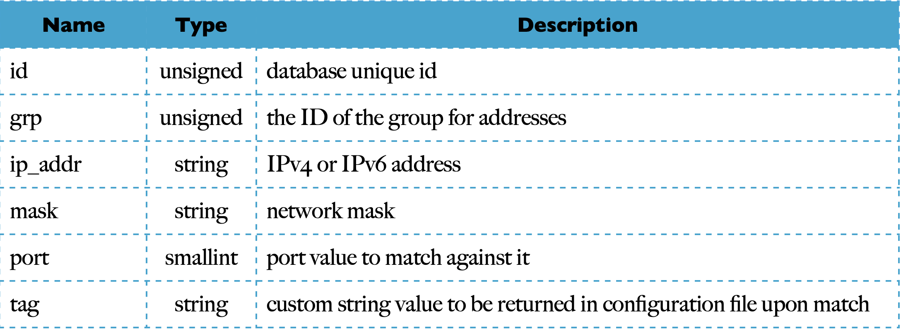

# Règles d'accès basées sur le IP

Dans de nombreux déploiements, l'instance de serveur SIP doit être interconnectée avec d'autres nœuds du réseau ou avec d'autres fournisseurs de services SIP. Il peut s'agir d'un serveur de média de transcodage, d'un proxy de périphérie, d'un fournisseur d'origine et de terminaison RTC ou d'un partenaire de peering amical.
Dans ces cas, les appels d'authentification par nom d'utilisateur et mot de passe sont la plupart du temps impossibles. La solution réside dans des relations IP de confiance. Chaque nœud SIP utilise une IP statique (ou se trouve dans un sous-réseau spécifique) qui est conservée dans une liste d'adresses de confiance. Lorsque les demandes SIP proviennent de ces adresses, elles sont autorisées sans être contestées pour l'authentification.
L'inverse pourrait également être utile, en bloquant le trafic provenant d'adresses IP spécifiques (par exemple, source d'attaques identifiée).
Il existe plusieurs options disponibles dans Kamailio pour tester les adresses sources des paquets SIP : - conditions statiques dans le fichier de configuration
- Module ipops pour une plus grande flexibilité dans la comparaison avec IPv6
- module d'autorisation pour la correspondance des adresses IP et des sous-réseaux
- des fonctions spécifiques dans plusieurs des modules de routage SIP

RÈGLES STATIQUES DANS LE FICHIER DE CONFIGURATION
L'interpréteur exporte plusieurs mots clés relatifs aux adresses IP associées aux requêtes SIP, ils sont énumérés dans le chapitre "Éléments du fichier de configuration". Les plus importants en relation avec l'adresse source des paquets sont
- src_ip - l'adresse IP à partir de laquelle le paquet SIP a été envoyé
- src_port - le port à partir duquel le paquet SIP a été envoyé
- proto - la couche de transport utilisée pour envoyer le paquet SIP (UDP, TCP, TLS ou SCTP) - af - famille d'adresses pour le protocole IP utilisé pour envoyer le paquet SIP (IPv4 ou IPv6)
Lorsqu'il s'agit d'une petite liste de pairs de confiance, peu susceptible de changer, la solution rapide consiste à ajouter des conditions dans le fichier de configuration.
Par exemple, si tout le trafic passe par un proxy périphérique situé au point 1.2.3.4, le serveur SIP principal peut avoir le bloc IF suivant juste au début du bloc request_route :

            if(src_ip!=1.2.3.4) {
             sl_send_reply("404", "Forbidden") ; 
            exit ;
            }

Pour supprimer également les réponses SIP qui ne proviennent pas de la version 1.2.3.4, vous pouvez ajouter dans la configuration le bloc reply_route suivant :
      
      reply_route { if(src_ip!=1.2.3.4)
      drop ;
      }
L'ajout de restrictions sur le port et le protocole peut être facilement effectué en utilisant les opérateurs logiques ET dans la condition IF, par exemple, en refusant le trafic s'il ne passe pas par l'UDP à partir du point 1.2.3.4 et du port 5060 :

          if( ! (src_ip==1.2.3.4 && src_port=5060 && proto==UDP) ) {
          sl_send_reply(“404”, “Forbidden”);
          exit;
          }
   
 Notez les opérateurs de négation dans l'expression IF et l'opérateur égal au lieu de différent lors de la comparaison de l'IP source.
Le mot-clé src_ip peut être testé par rapport à une adresse de sous-réseau. Une adresse de réseau est représentée par le masque de bits slash de l'adresse IP (longueur ou masque de réseau). Tester si les paquets proviennent de la version 1.2.3.0/24 peut se faire de la même manière :

          if(src_ip!=1.2.3.0/24) { 
              sl_send_reply(“404”, “Forbidden”); 
              exit;
          }
          or

          if(src_ip != 1.2.3.4/255.255.255.0){
              sl_send_reply("404", "Not found");
              exit;
          }

Some of these keywords have an equivalent in the pseudo-variables: • src_ip is $si
- **src_port is $sp**
- **proto is $pr (or $proto)**
But their values are returned as string or integer. Therefore comparing $si has to be done against a string value, like:

      if($si!=”1.2.3.4”) { 
      sl_send_reply(“404”, “Forbidden”); 
      exit;
      }

Pour les opérations de comparaison avec les pseudo-variables IP, il est recommandé d'utiliser les fonctions du module ipops, qui est présenté dans la section suivante.
Le mot-clé src_ip peut être comparé avec le mot-clé "myself" pour tester si le paquet a été envoyé à partir d'une adresse IP que le serveur SIP écoute (du même hôte).
Outre l'adresse IP source, il peut parfois être plus pratique d'avoir les conditions d'accès sur l'IP locale où les paquets ont été reçus 
- c'est ce que fournit le mot-clé dst_ip.
Cela peut être le cas lorsque vous êtes interconnecté via un VPN avec un partenaire de confiance. Le serveur SIP peut écouter sur de nombreuses prises locales, l'une d'entre elles étant reliée au tunnel VPN. Supposons que le côté serveur SIP du tunnel soit 2.3.4.5 et que vous vouliez sauter l'authentification du trafic qui y arrive. Au début de l'itinéraire [AUTH], il faut ajouter le bloc IF suivant :

               IP authorization and user uthentication route[AUTH] {
              if(dst_ip==2.3.4.5) {
              # received on the VPN - skip authentication return;
              }
              #!ifdef WITH_AUTH

L'équivalent de dst_ip dans la pseudo-variable est $Ri et pour dst_port est $Rp. Le protocole de la couche transport est le même pour la source et la destination, respectivement $pr.

RÈGLES DU MODULE IPOPS DANS LE FICHIER DE CONFIGURATION

La comparaison des adresses IPv4 peut être effectuée en toute sécurité en utilisant la représentation en chaîne pointillée, donc l'utilisation de $si pour comparer avec une valeur de chaîne ou une autre variable donne les résultats attendus.
Mais les adresses IPv6 peuvent être écrites de plusieurs façons, avec ou sans zéros de tête, avec ou sans double-points. L'utilisation de la comparaison pure de chaînes de caractères n'est plus une bonne option.
Kamailio propose un module dédié qui exporte plusieurs fonctions pour les opérations sur les adresses IP, nommé ipops, son readme est disponible en ligne à l'adresse
- http://kamailio.org/docs/modules/4.2.x/modules/ipops.html. La fonction la plus pertinente pour le sujet de cette section est
compare_ips(addr1, addr2)
Les paramètres peuvent être des valeurs de chaîne d'adresses IP ou des variables qui contiennent des adresses IP. La fonction renvoie vrai si les adresses IP correspondent et faux dans le cas contraire. Elle permet de comparer aux références IPv6 ainsi que de comparer la représentation IPv6 d'une adresse IPv4.
L'exemple suivant teste si le paquet est reçu de l'interface de bouclage sur IPv6 :

          if(compare_ips("$si", "[::1]")) {
          # paquet reçu du loopback via IPv6 .....
          }

Une autre fonction utile est de vérifier si une adresse IP appartient à un sous-réseau, c'est-à-dire
is_in_subnet("addr", "subnet")
Le premier paramètre est l'adresse IP ou une pseudo-variable contenant une adresse IP et le second paramètre est l'adresse du sous-réseau, sous forme de chaîne ou fournie par une pseudo-variable.
Ensuite, un exemple permet de vérifier si le paquet a été reçu du sous-réseau 1.2.3.0/24 :

          if(is_in_subnet("$si", "1.2.3.0/24")) {
          # packet received from subnet 1.2.3.4/24
          .....
          }
L'ipops exporte plusieurs autres fonctions liées aux opérations sur les adresses IP, parmi lesquelles le test de la présence d'une adresse IPv4 ou IPv6 et le test de la présence d'une adresse IPv4 dans la plage privée spécifiée par la RFC1918.

## LES RÈGLES DU MODULE DE PERMISSIONS DANS LE FICHIER DE CONFIGURATION

La permission de module offre une manière plus flexible de stocker et de gérer la liste des adresses IP à utiliser pour les conditions dans le fichier de configuration.
Il utilise une table de base de données, nommée adresse, où les adresses (ainsi que le port et une valeur de chaîne de balises) peuvent être regroupées dans un même ID. Dans le fichier de configuration, un ensemble de fonctions peut être utilisé pour tester si l'IP source ou une variable donnée représente une adresse qui correspond à un enregistrement de ce groupe, en retournant en cas de correspondance la valeur de la chaîne de caractères dans une variable de configuration spécifiée.
L'adresse de la table de la base de données est définie par l'instruction SQL

      CREATE TABLE address (
      id INT(10) UNSIGNED AUTO_INCREMENT PRIMARY KEY NOT NULL, grp INT(11) UNSIGNED DEFAULT 1 NOT NULL,
      ip_addr VARCHAR(48) NOT NULL,
      mask INT DEFAULT 32 NOT NULL,
      port SMALLINT(5) UNSIGNED DEFAULT 0 NOT NULL,
      tag VARCHAR(64)
      ) ENGINE=MyISAM;
      
 Meaning of the columns is presented in the next table
 
 
 
L'ID de groupe doit être 1 (un) ou plus, 0 (zéro) n'étant pas autorisé en raison de la signification particulière des codes de retour des fonctions pour le fichier de configuration.
Si le port est défini à 0 (zéro), il ne sera pas utilisé pour la correspondance (la correspondance se fera uniquement sur l'adresse IP). La valeur du tag est optionnelle, si elle n'est pas définie, rien n'est renvoyé dans la variable du fichier de configuration qui lui est associée.
 
Les enregistrements de la table de la base de données sont chargés par Kamailio au démarrage et mis en cache sous une forme pré-compilée qui est utilisée au moment de l'exécution. Le module de permission peut réagir sur une commande de contrôle MI/RPC et recharger les enregistrements sans avoir besoin de redémarrer.
La documentation relative à ce module est disponible en ligne à l'adresse suivante
- http://kamailio.org/docs/modules/4.2.x/modules/permissions.html

### LA GESTION DES DOCUMENTS 

L'ajout, la suppression ou la mise à jour des enregistrements dans la base de données peuvent se faire via : 
- kamctl
- siremis

### GESTION AVEC KAMCTL
Kamctl fournit la commande "address" pour gérer les enregistrements utilisés par le module de permission à partir de la table de base de données "address". Ensuite, le message d'aide imprimé par l'outil kamctl pour cette commande :

~# kamctl address
--command 'add|dump|reload|rm|show' - manage address
-address show ...................... show db content
-address dump ...................... show cache content address 
-reload .................... reload db table into cache address
-add <grp> <ipaddr> <mask> <port> <tag>
....................... add a new entry
....................... (mask, port and tag are optional arguments) 
            
-address rm <grp> <ipaddr> ......... remove entries for given grp and ipaddr
            
Comme indiqué ci-dessus, les sous-commandes disponibles sont :
- show - kamctl effectue une requête SQL et imprime le contenu de l'adresse de la table de la base de données
- dump - kamctl envoie la commande MI 'address_dump' pour récupérer le contenu du cache du module de permissions
- reload - kamctl envoie la commande MI 'address_reload' pour demander à Kamailio de recharger les enregistrements de la table de la base de données
- add - kamctl effectue une requête SQL pour insérer un nouvel enregistrement dans l'adresse de la table de la base de données. Notez que le nouvel enregistrement n'est pas encore utilisé par un Kamailio en cours d'exécution, une commande de rechargement d'adresse doit être émise pour que le serveur SIP soit informé des mises à jour.
- rm - kamctl effectue une requête SQL pour supprimer des enregistrements dans l'adresse de la table de la base de données. Notez que les enregistrements supprimés sont toujours utilisés par un Kamailio en cours d'exécution, une commande de rechargement d'adresse doit être émise pour que le serveur SIP soit au courant des mises à jour.

La procédure habituelle pour gérer les enregistrements d'adresses pour le module de permission consiste à mettre à jour d'abord la table de la base de données (en faisant plusieurs ajouts/suppressions si nécessaire) et ensuite à lancer une commande de rechargement MI/RPC.
L'exemple suivant montre l'ajout des adresses IP 1.2.3.4 et 2.3.4.5 au groupe de confiance 1 :

            kamctl address add 1 1.2.3.4 32 0 “mediasrv” 
            kamctl address add 1 2.3.4.5 32 0 “pstngw” 
            kamctl address reload
            
Le masque de réseau est réglé sur 32 pour correspondre à l'IP complète et le port est réglé sur 0 (zéro) pour l'ignorer. La valeur #tag est définie comme une courte représentation du type de dispositif de peering, respectivement un serveur de média et une passerelle RTPC.
La suppression de l'IP 1.2.3.4 est effectuée par :

            kamctl address rm 1 1.2.3.4 
            kamctl address reload

MANAGEMENT WITH SIREMIS

Siremis includes a dedicated view for managing permissions’ address records. It is available in the panel SIP Admin M enu, at ACL S ervices => P ermissions - Address. To add a new record, press Add button in the main list view. Next image presents the form for adding a new record:

Dans la liste principale des adresses des modules d'autorisation, les boutons qui permettent de les utiliser sont affichés : 

- l'ajout de nouveaux enregistrements |        adding new records                        
- la suppression des enregistrements|           removing records
- l'édition des dossiers |                       editing records
- la recherche de dossiers |                    searching records
- l'exportation de documents vers un fichier |  exporting records to a file
- la navigation à travers plusieurs pages d'enregistrements|  navigation through multiple pages of records

