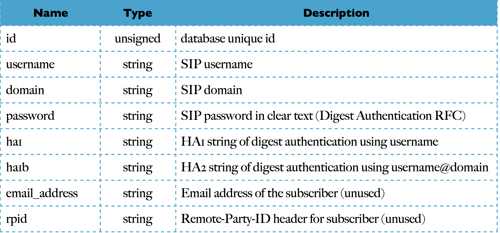

## MISE À JOUR DE L'IDENTIFICATION DE L'APPELANT AVEC LES AFFECTATIONS

L'utilisation du module UAC ajoute une surcharge en stockant les valeurs initiales et nouvelles des attributs de l'en-tête From soit dans le cookie d'en-tête Record-Route, soit dans les variables du module de dialogue. Dans de nombreux déploiements, seuls les dispositifs conformes à la RFC3261 sont autorisés, ce qui signifie que la mise à jour des attributs de l'en-tête From et leur non restauration ne créent aucun dommage.
Dans de tels cas, il suffit de remplacer les attributs d'en-tête From pour le premier INVITE seulement, car c'est celui qui définit l'identification de l'appelant dans l'historique des appels des dispositifs. En comparaison avec l'exemple relatif à la normalisation de l'ID de l'appelant de l'une des sections précédentes, la fonction uac_replace_from(...) doit être remplacée par :MISE À JOUR DE L'IDENTIFICATION DE L'APPELANT AVEC LES AFFECTATIONS

L'utilisation du module UAC ajoute une surcharge en stockant les valeurs initiales et nouvelles des attributs de l'en-tête From soit dans le cookie d'en-tête Record-Route, soit dans les variables du module de dialogue. Dans de nombreux déploiements, seuls les dispositifs conformes à la RFC3261 sont autorisés, ce qui signifie que la mise à jour des attributs de l'en-tête From et leur non restauration ne créent aucun dommage.
Dans de tels cas, il suffit de remplacer les attributs d'en-tête From pour le premier INVITE seulement, car c'est celui qui définit l'identification de l'appelant dans l'historique des appels des dispositifs. En comparaison avec l'exemple relatif à la normalisation de l'ID de l'appelant de l'une des sections précédentes, la fonction uac_replace_from(...) doit être remplacée par :

          $fn = $var(caller);
          $fu = “sip:” + $var(caller) + “@” +$fd;
          
Pour l'anonymat, lorsqu'on veut qu'aucun message SIP ne porte d'indication sur l'appelant, on peut exécuter pour toutes les demandes (initiales ou dans le dialogue) les actions suivantes avant de passer au saut suivant :

              if(!has_totag() || is_direction(“downstream”)) { 
              $fn = “Unknown”;
              $fu = “sip:anonymous@invalid”;
              }

La fonction is_direction(...) est exportée par le module rr et peut détecter si la requête va de l'appelant à l'appelé (en aval) ou de l'appelé à l'appelant (en amont).

## Authentification de l'utilisateur 

### APERÇU DE L'AUTHENTIFICATION SIP

Le mécanisme d'authentification des utilisateurs pour le SIP est emprunté à HTTP, respectivement à l'authentification www digest - RFC2617. Il s'agit d'un paradigme défi-réponse :
- UA envoie la requête sans aucune authentification
- le serveur répond avec un défi, en ajoutant l'en-tête avec les attributs à utiliser pour
construire des justificatifs d'authentification
- UA envoie à nouveau la demande en ajoutant l'en-tête avec les données d'authentification - le serveur accepte ou refuse l'authentification
Si le serveur est le point de terminaison (par exemple, le bureau d'enregistrement), il doit demander l'autorisation www, en répondant par une réponse 401. Si le serveur est un relais (par exemple, un proxy), il doit demander l'autorisation du proxy, en répondant par 407.
Le diagramme suivant montre le flux de messages SIP d'autorisation www pour l'enregistrement sur le serveur kamailio.org et les en-têtes impliqués dans le processus :

Sur le chemin de l'appelant à l'appelé, une demande SIP peut être contestée pour authentification par de nombreux sauts. Il n'y a pas beaucoup de téléphones SIP qui supportent de tels scénarios, mais c'est quelque chose de possible du point de vue des spécifications. Il est plus courant que l'utilisateur s'authentifie avec un
(son serveur d'origine) et les nœuds intermédiaires suivants dans le chemin se font confiance par adresse IP.
Le schéma suivant montre un cas de double authentification, l'une par un proxy et l'autre par un serveur de médias (qui termine l'appel) :

Les réponses SIP demandant l'authentification portent des en-têtes spéciaux avec les attributs à utiliser pour construire la réponse d'authentification. Il s'agit de
- WWW -Authenticate, dans la réponse 401
- Proxy-Authenticate, dans la réponse 407
En réponse à un défi d'authentification, les demandes portent les références dans différents les en-têtes :
- Autorisation, dans les demandes faisant suite à une contestation 401
- Proxy-Autorisation, dans les demandes faisant suite à une contestation 407
Les attributs (également appelés paramètres) des en-têtes sont les mêmes, pour les réponses SIP comme pour les demandes SIP, seul le nom des en-têtes est différent.
Le tableau suivant montre les attributs et les endroits où ils peuvent être présents

## MODULES D'AUTHENTIFICATION
 
Il existe plusieurs modules dans Kamailio qui sont liés à l'authentification des utilisateurs :
- auth - il met en œuvre l'API commune pour l'authentification des utilisateurs, généralement réutilisée par les autres modules, ainsi que des fonctions d'authentification avec le mot de passe de l'utilisateur fourni comme paramètre
- auth_db - il met en œuvre l'authentification des utilisateurs en récupérant le mot de passe sur un serveur de base de données
- auth_diameter - il met en œuvre l'authentification des utilisateurs par rapport à un serveur Diameter (développé lorsque Diameter était un projet de l'IETF, pourrait nécessiter des ajustements pour les nouveaux serveurs Diameter)
- auth_identity - il met en œuvre les extensions de l'identité d'authentification, RFC4474
- auth_radius - il met en œuvre l'authentification des utilisateurs par rapport à un serveur Radius
La plupart des systèmes d'authentification utilisés sont des systèmes de base de données ou des systèmes dorsaux Radius. L'utilisation d'un backend de base de données personnalisé est une solution lorsque le nom d'utilisateur et le mot de passe peuvent être récupérés via une API, ce qui permet une intégration simple avec les systèmes existants.

## L'AUTHENTIFICATION À L'AIDE D'UN BACKEND DE BASE DE DONNÉES

Le fichier de configuration par défaut permet d'activer l'authentification des utilisateurs à l'aide d'une base de données ou d'un serveur MySQL. Vous devez ajouter deux définitions :

          #!define WITH_MYSQL 
          #!define WITH_AUTH

Voyons un peu plus en détail les parties relatives à l'authentification des utilisateurs dans le fichier de configuration. Les extraits sont ci-dessous :

Tout d'abord, les deux modules nécessaires sont chargés : auth et auth_db. Plusieurs paramètres sont définis pour auth_db :
- db_url - pour définir l'URL de connexion au serveur de base de données, dans ce cas il s'agit du jeton défini DBURL qui est défini comme serveur MYSQL sur localhost, en utilisant le nom d'utilisateur, le mot de passe et le nom de la base de données par défaut
- calculate_ha1 - spécifie que le mot de passe chargé à partir de la table de la base de données est en format de texte simple, donc le module doit calculer la chaîne de hachage HA1 à partir de celui-ci
- password_column - indique le nom de la colonne de la table de la base de données qui stocke le mot de passe
- load_credentials - peut spécifier une liste de colonnes supplémentaires qui peuvent être chargées dans la même requête pour récupérer le mot de passe
- use_domain - spécifie si le déploiement est multi-domaine ou non (c'est-à-dire si la partie domaine est importante dans la construction de l'ID utilisateur unique), défini à la valeur MULTIDOMAIN (qui est désactivé par défaut)
A l'intérieur du bloc request_route, une sous-route, route [AUTH] est exécutée à la ligne 486 - elle est après le traitement commun et les demandes au sein des actions de dialogue, juste après la vérification des retransmissions avec t_check_trans().
La route [AUTH] est la sous-route qui contient les actions d'authentification d'utilisation. Elle a d'abord la vérification des pairs IP de confiance (dans le cas où cela est défini), mais ce qui nous concerne dans cette section sont les actions entre les lignes 733 et 750.
La première condition (ligne 733) est de voir si les demandes doivent être authentifiées, ce qui est fait pour :
- toutes les demandes d'enregistrement - ce qui garantit également que l'instance n'est pas un relais pour les enregistrements vers d'autres serveurs

- toutes les autres requêtes qui ont l'URI d'en-tête From correspondant à une IP locale, un nom d'hôte ou un alias (c'est-à-dire correspondant à la condition de moi-même)
L'authentification est effectuée principalement par deux actions :
- auth_check(...) - cette fonction est exportée par le module auth_db. Elle renvoie vrai s'il existe un en-tête Authorization/Proxy-Authorization qui correspond au domaine de l'instance et que la réponse d'authentification correspond à la valeur calculée localement
- auth_challenge(...) - cette fonction est exportée par le module auth. Elle construit les en-têtes de réponse au défi (WWW-Authenticate ou Proxy-Authenticate) et renvoie la réponse 401 ou 407
Par conséquent, les actions entre les lignes 736-739 peuvent être lues comme suit : s'il n'y a pas d'en-tête d'autorisation ou si la réponse d'authentification ne correspond pas, alors envoyez une réponse de défi d'authentification et arrêtez le traitement de la demande.
Les deux fonctions, auth_check() et auth_challenge() prennent realm comme premier paramètre, dans ce cas il s'agit de la pseudo-variable pour le domaine URI de l'en-tête From. auth_check() a le second paramètre pour spécifier la table de base de données d'où aller chercher le mot de passe de l'utilisateur.
Le dernier paramètre pour les deux fonctions est une valeur entière avec des drapeaux pour contrôler le comportement et les vérifications internes, y compris le test du nom d'utilisateur d'authentification par rapport à l'URI de l'en-tête From ou To. Ces fonctions sont documentées dans les fichiers readme :
- http://kamailio.org/docs/modules/4.2.x/modules/auth_db.html
- http://kamailio.org/docs/modules/4.2.x/modules/auth.html
Si l'authentification de l'utilisateur était correcte, le traitement saute à la ligne 721, ce qui supprime pratiquement les en-têtes d'autorisation pour les demandes qui sont très susceptibles d'être relayées à d'autres sauts (bon pour la sécurité, même les valeurs sont des hachages MD5, il vaut mieux ne pas laisser d'autres parties les voir).
L'action consume_credentials() est celle qui fait correspondre les en-têtes d'autorisation pour la zone locale et les supprime. REGISTER et PUBLISH sont des requêtes pour le serveur lui-même, qui ne doivent pas être relayées, donc cela n'a pas de sens de faire une opération sans effet réel.
La dernière vérification dans l'itinéraire [AUTH] est de s'assurer que l'instance n'est pas un relais ouvert, les lignes 746-750. Cela signifie que soit l'appelant doit être un utilisateur local (ce qui a été authentifié par un nom d'utilisateur et un mot de passe), soit l'appelé doit être un utilisateur local, de sorte que l'appel se termine dans le service local. En d'autres termes, si l'appelant et l'appelé sont tous deux des utilisateurs ou des services étrangers, alors les demandes sont rejetées.

## TABLEAU DES ABONNÉS

Le module d'authentification de la base de données (auth_db) récupère les enregistrements de la table des abonnés. Cette table a la structure définie par le script SQL suivant :

                    CREATE TABLE subscriber (
                    id INT(10) UNSIGNED AUTO_INCREMENT PRIMARY KEY NOT NULL, username VARCHAR(64) DEFAULT '' NOT NULL,
                    domain VARCHAR(64) DEFAULT '' NOT NULL,
                    password VARCHAR(25) DEFAULT '' NOT NULL,
                    email_address VARCHAR(64) DEFAULT '' NOT NULL,
                    ha1 VARCHAR(64) DEFAULT '' NOT NULL,
                    ha1b VARCHAR(64) DEFAULT '' NOT NULL,
                    rpid VARCHAR(64) DEFAULT NULL,
                    CONSTRAINT account_idx UNIQUE (username, domain)
                    ) ENGINE=MyISAM;

Les colonnes sont expliquées dans le tableau suivant :

## CHARGEMENT DES JUSTIFICATIFS 

Une caractéristique importante du module auth_db est fournie par le paramètre load_credentials. Il permet de spécifier une liste de colonnes dont les valeurs seront chargées dans les variables du fichier de configuration lors de la récupération du mot de passe dans la base de données.
Cela permet d'enregistrer une requête à la base de données si vous avez besoin de ces valeurs. Vous devez créer les colonnes supplémentaires dont vous avez besoin.
Un cas d'utilisation courant est d'ajouter une colonne pour stocker un drapeau qui marque l'abonné comme actif ou inactif, en vérifiant la valeur dans le fichier de configuration après authentification.
Voici comment procéder :
- ajouter une colonne nommée "status" avec le type "integer
- si la valeur dans la colonne statut est 0 (zéro), alors l'utilisateur est actif et il peut s'enregistrer et passer des appels
- si la valeur dans la colonne statut est 1 (un), alors l'utilisateur est inactif et il n'est pas autorisé à s'enregistrer ou à passer des appels

          ALTER TABLE subscriber ADD COLUMN status INT NOT NULL DEFAULT 0;
          
- définir le paramètre load_credential pour charger la valeur de la colonne dans $avp(status) 
363. modparam("auth_db", "load_credentials", "$avp(status)=status")
- dans le fichier de configuration, dans la route [AUTH], après que le contrôle d'authentification ait été ok, ajoutez le test pour le $avp(status), les lignes commençant par '+' :

          if (!auth_check("$fd", "subscriber", "1")) {
          auth_challenge("$fd", "0");
          exit;
          }
          ##Nous ajoutons code pour controler le status de l'abonné 

          if($avp(status)==1) {
          send_reply(“404”, “Forbidden”);
          exit;
          }
          #user authenticated - remove auth header
     
La fonction auth_check() est celle qui charge le mot de passe et les colonnes supplémentaires. Une authentification réussie garantit que ces valeurs ont été chargées, l'ajout au fichier de configuration route [AUTH] étant seulement un bloc IF pour tester la valeur de $avp(status) et renvoyer un code de réponse 403 si l'utilisateur est inactif.

## LES FONCTIONS D'AUTHENTIFICATION

La fonction auth_check(...) est une enveloppe autour de deux autres fonctions, www_authenticate(...) et proxy_authenticate(...), qui vise le cas d'utilisation typique, pour simplifier le fichier de configuration. Mais il y a des cas où une plus grande flexibilité est nécessaire.
Par exemple, auth_check() peut tester si le nom d'utilisateur d'authentification correspond à la valeur du nom d'utilisateur présentée dans l'en-tête From ou To, pour éviter l'usurpation de l'identité de l'appelant ou le vol d'identité. Elle permet donc que chaque abonné ne s'enregistre que pour lui-même.
Cependant, les spécifications SIP permettent à une partie d'enregistrer des contacts pour une autre partie. Si vous souhaitez déployer une telle configuration, vous devrez rompre l'usage de auth_check() dans www_authenticate() et proxy_authenticate() en effectuant les contrôles d'identité séparément selon vos besoins.
En pratique, la route d'authentification présente dans le fichier de configuration par défaut de Kamailio 4.2.x est à peu près équivalente à :

