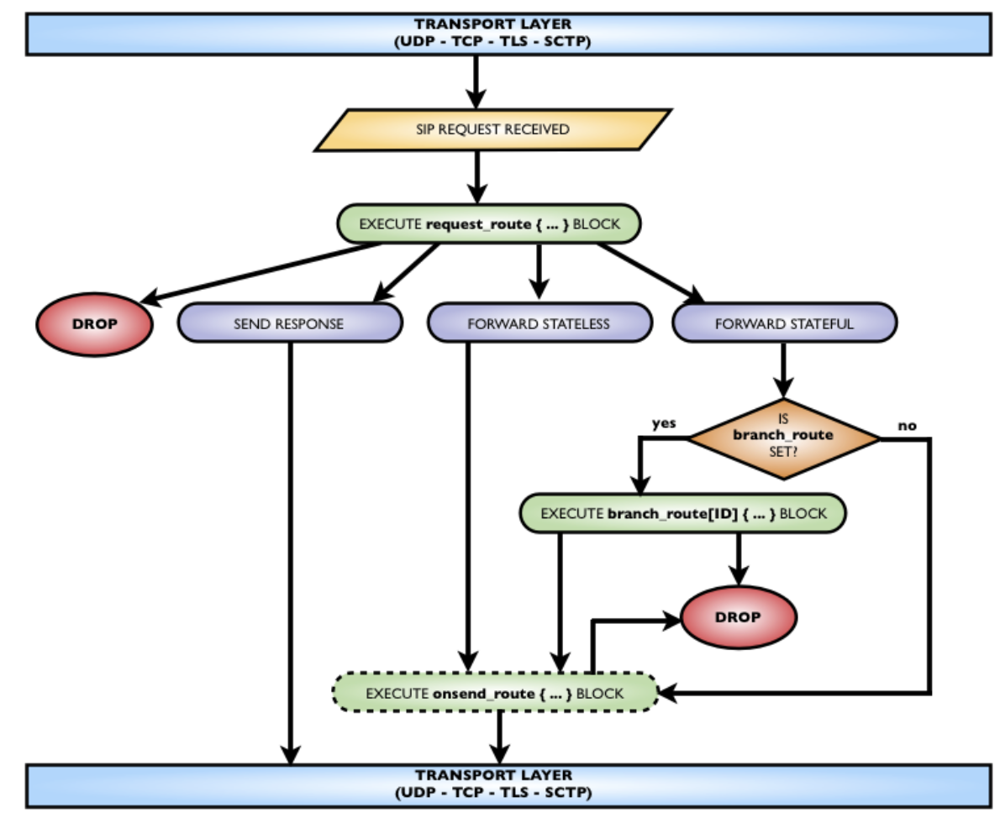
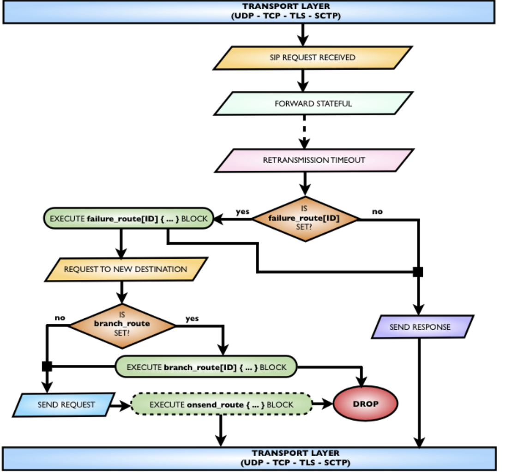

## COMPOSANTES SUPPLÉMENTAIRES
La procédure d'installation présentée jusqu'à présent déploie le noyau de Siremis et fournit des vues préconfigurées pour accéder aux tables de la base de données utilisée par Kamailio.
Mais certains des composants nécessitent une configuration supplémentaire pour fonctionner correctement. Les sections suivantes présentent les détails de la mise en place de ces composants.
SERVICES DE COMPTABILITÉ
Ce composant nécessite que vous ayez coché l'option "Update SIP DB" dans la deuxième étape de l'assistant d'installation. Il nécessite également d'activer la comptabilité à la base de données dans le fichier de configuration de Kamailio.
Il y aura un chapitre dédié qui présente le mécanisme de comptabilité dans Kamailio, où nous détaillons également la partie correspondante dans Siremis, en la sautant ici pour éviter les doublons.

##PANNEAU DE COMMANDES MI
Ce composant donne une vue web qui peut envoyer des commandes MI via UDP à Kamailio et affiche la réponse. La configuration par défaut de Kamailio ne charge que le module mi_fifo, qui est destiné aux commandes MI envoyées via un fichier FIFO.
Pour pouvoir utiliser cette vue dans Siremis, vous devez charger le module mi_datagram dans le fichier de configuration de Kamailio :
loadmodule "mi_datagram.so" (charger le module "mi_datagram.so")
Le module est compilé et installé par défaut. Il faut ensuite spécifier l'IP et le port pour l'écoute des commandes MI, Siremis attend 127.0.0.1 et le port 8033 :
modparam("mi_datagram", "socket_name", "udp:127.0.0.1:8033")
Vous pouvez changer l'IP et le port comme vous le souhaitez, même pour les interfaces publiques, mais assurez-vous de protéger l'accès par un pare-feu, pour permettre la communication uniquement entre les hôtes Kamailio et Siremis. Permettre à tout le monde d'envoyer des commandes MI est dangereux, car cela peut permettre de récupérer des informations de Kamailio sans aucune authentification, et peut également déclencher l'arrêt de Kamailio.
Lorsque vous modifiez l'adresse IP et le port du paramètre de module "soket_name", vous devez également mettre à jour le fichier de configuration XML correspondant dans Siremis, situé à l'adresse suivante

            siremis/modules/ser/service/siremisMICommands.xml
            The content of this file for Siremis v4.0.0 is:
            <PluginService Name="siremisMICommands" Package="asipto" Class="siremisMICommands"> <MIConfig name="MIConfig" type="udp" mode="rich">
            <Local name="local" address="127.0.0.1" port="8044" timeout="3.0"/> <Remote name="remote" address="127.0.0.1" port="8033"/> <MICommands>
            <cmd name="ps" title="List Processes" command="ps"/>
            <cmd name="uptime" title="Show Uptime" command="uptime"/>
            <cmd name="getstatsall" title="Get All Statistics" command="get_statistics all"/>
            <cmd name="which" title="Get All MI Commands" command="which"/>
            <cmd name="dslist" title="List Dispatcher Records" command="ds_list"/>
            <cmd name="dsreload" title="Reload Dispatcher Records" command="ds_reload"/>
            <cmd name="pdtlist" title="List PDT Records" command="pdt_list"/>
            <cmd name="pdtreload" title="Reload PDT Records" command="pdt_reload"/>
            <cmd name="uldump" title="List Location Records" command="ul_dump"/>
            <cmd name="uldumpbrief" title="Brief of Location Records" command="ul_dump brief"/> <cmd name="addrlist" title="List Address Permissions Records"
            command="address_dump"/>
            <cmd name="subnlist" title="List Subnet Permissions Records" command="subnet_dump"/
            >
            <cmd name="addrreload" title="Reload Address Permissions Records" command="ad-
            dress_reload"/> </MICommands>
            </MIConfig> </PluginService>
            
            
            
 Les sockets de communication sont spécifiés par les éléments XML :
- Local - où vous pouvez spécifier l'adresse IP locale à laquelle Siremis doit se connecter, le port et le délai d'attente en secondes de la réponse à la commande MI
- Remote - vous pouvez spécifier l'IP et le port distant où Kamailio écoute les commandes MI, il doit correspondre à la valeur du paramètre "socket_name" du module mi_datagram dans le fichier de configuration de Kamailio
L'élément MICommands peut contenir une liste de commandes MI qui apparaîtra dans une sélection déroulante dans la vue des commandes MI de Siremis, ce qui facilite leur exécution en quelques clics au lieu de taper la commande.
La vue Web de Siremis pour cet élément est disponible dans le menu à SIP Admin => Commands Services => MI Commands. La capture d'écran suivante la présente.
Elle offre un champ de saisie dans lequel les commandes MI peuvent être tapées et ensuite exécutées en cliquant sur le bouton "Run".

## PANNEAU DE COMMANDES XMLRPC

L'autre option offerte par Siremis pour envoyer des commandes de contrôle à Kamailio est via XMLRPC. Il s'agit de commandes de type RPC pour le contrôle de Kamailio, et non de MI comme dans la section précédente. La vue de cette option est accessible sur SIP Admin => Commands Services => MI Commands. La capture d'écran suivante l'affiche.

## SERVICES DE CARTOGRAPHIE
Siremis est capable de créer et d'afficher des graphiques en utilisant la bibliothèque Open Flash Chart (sous licence GPL) - la bibliothèque est incluse dans le tarball de distribution de Siremis, vous n'avez rien d'autre à faire. Votre navigateur web doit être équipé d'un plug-in Flash Player.
Les données pour créer les graphiques sont tirées des tables résidant dans la base de données Kamailio. Il n'existe pas de tels tableaux par défaut - l'assistant d'installation de Siremis crée un tableau nommé "statistiques" avec des mesures prédéfinies, vous pouvez l'étendre si vous le souhaitez ou en créer un autre suivant le même type de structure.
Le tableau doit comporter une colonne qui stocke l'horodatage. Les valeurs temporelles sont utilisées pour l'axe des X dans les graphiques. Les autres colonnes doivent stocker des valeurs entières représentant la dépendance temporelle d'un attribut particulier.
Outre les graphiques dynamiques, le service des graphiques comprend des vues pour les graphiques ou les résumés générés à partir d'autres tables Kamailio, telles que la localisation ou l'acc. Pour ces derniers, il n'est pas nécessaire de faire quoi que ce soit, il suffit de charger les modules appropriés (usrloc ou acc) dans Kamailio et de les configurer avec le support de stockage de base de données.

CONFIGURATION KAMAILIO
rtimer pour exécuter périodiquement un blocage d'itinéraire à partir du fichier de configuration de Kamailio, où il insère les valeurs statistiques dans la base de données.
Les étapes suivantes sont présentées pour faire fonctionner les cartes livrées par défaut avec Siremis. Certaines des statistiques sont tirées directement des statistiques internes de Kamailio, d'autres sont construites par des opérations de configuration, en utilisant htable pour stocker les états en mémoire.

Les mesures stockées dans la table de la base de données sont :
- time_stamp - horodatage au moment de l'insertion
- shm_used_size - taille utilisée de la mémoire partagée
- shm_real_used_size - taille utilisée et surcharge de la mémoire partagée
- shm_max_used_size - taille maximale utilisée de la mémoire partagée
- shm_free_used_size - taille libre de la mémoire partagée
- ul_users - nombre d'utilisateurs actifs dans le service de localisation
- ul_contacts - numéro de l'adresse de contact dans le service de localisation
- tm_active - nombre de transactions actives
- rcv_req_diff - nombre de demandes reçues au cours des cinq dernières minutes
- fwd_req_diff - nombre de demandes transmises au cours des cinq dernières minutes
- 2xx_trans_diff - nombre de transactions réussies au cours des cinq dernières minutes
Les statistiques sont enregistrées toutes les cinq minutes, vous pouvez modifier l'intervalle en mettant à jour le paramètre "timer" du module de chronométrage.

L'URL pour la vue web a le format "/siremis/ser/charts_cgname/cg=cgname", où cgname est la valeur de l'attribut name pour un ChartGroup, dans notre cas c'est 'shm'. La variable spéciale {@home:url} est remplacée par Siremis avec l'adresse du serveur et l'URL de base du déploiement de Siremis (par exemple, c'est '/siremis' dans une installation par défaut).
Pour rendre la nouvelle entrée visible dans le menu, le module ser de Siremis doit être rechargé, allez dans le panneau d'administration, Menu Application => Modules => Gestion des modules, sélectionnez 'ser' dans la liste et cliquez ensuite sur le bouton 'Recharger'. Retournez dans le panneau d'administration du SIP et l'entrée devrait être visible dans le groupe de menu "Services de cartes".

CAPTURES D'ÉCRAN DES GRAPHIQUES
Ensuite, trois captures d'écran des graphiques présentés :
- utilisateurs en ligne vs nombre de contacts - le groupe de graphiques usrloc 
- le rapport sur les relevés de services de localisation

Une caractéristique très utile de Siremis est la possibilité d'ajouter rapidement des vues pour la gestion des tables de la base de données. Il fournit un ensemble de scripts PHP qui peuvent être exécutés en ligne de commande. Le fait de fournir quelques paramètres au script principal permet de créer la vue en quelques instants.
La plupart des tables utilisées par Kamailio sont déjà couvertes par la distribution existante de Siremis, il en manque encore certaines (qui devraient être ajoutées dans le futur), mais dans de nombreux cas vous pouvez avoir des tables personnalisées utilisées par Kamailio (via le module sqlops par exemple).
Nous présentons ici les étapes à suivre pour ajouter de nouvelles vues web pour les tables de base de données.

Allez à siremis/bin/toolx dans le répertoire Siremis.
Là, vous devez exécuter gen_meta.php, en donnant comme paramètre l'ID de connexion à la base de données (pour la base de données Kamailio, c'est Serdb), le nom de la table et l'ID du sous-module Siremis.
La commande suivante montre comment la vue pour la table mtree a été générée :
php gen_meta.php Serdb mtree ser.rtg.mtree
Dans cet exemple, l'ID du sous-module Siremis est ser.srv.mtree, ce qui signifie
- il fait partie du module Siremis ser (où se trouvent tous les composants liés à Kamailio) - les formulaires générés doivent se trouver dans le répertoire siremis/modules/ser/srv/mtree/
- pratiquement, si vous remplacez le point (.) par une barre oblique, l'ID du sous-module Siremis correspond au chemin d'accès à l'intérieur du répertoire siremis/modules
Si vous regardez à l'intérieur de siremis/modules/ser/srv/mtree/, il y a deux sous-répertoires : - do - spécifications des objets de données
- formulaire - spécifications des formulaires web - ajout, édition, copie, visualisation ou recherche de fiches d'arbres
Un autre fichier généré est le Siremis Web View pour la gestion des arbres. Il se trouve à l'adresse suivante
siremis/modules/ser/view/MtreeListView.xml
Il comprend les références aux objets Form utilisés pour cette vue.

SUBST
Define fournit un mécanisme de remplacement des jetons autonomes. Il est parfois utile de pouvoir remplacer à l'intérieur d'une chaîne la valeur d'un jeton.
Par exemple, vous ne pouvez pas définir MYID à remplacer dans la ligne suivante :
xlog("imprimer la valeur de MYID\n") ;
Dans ce cas, MYID est une sous-chaîne du paramètre de la fonction xlog(), ce n'est pas un élément autonome du fichier de configuration.
La solution à ces cas est fournie par la directive subst preprocessor, dont le prototype est similaire aux expressions de substitution SED ou Perl :
#!subst "<sep> regexp <sep> subst <sep> flags"
Il comporte quatre éléments :
- <sep> - un seul caractère à utiliser comme séparateur entre les autres composantes. Parmi les séparateurs couramment utilisés : "/", "%" ou "#
- regexp - expression régulière à faire correspondre à l'intérieur de la chaîne de caractères des valeurs - subst - valeur de substitution pour remplacer les jetons correspondants
- drapeaux - drapeaux pour contrôler la substitution, un élément optionnel. Les drapeaux peuvent être une combinaison de :
- i - pour correspondre à la chaîne de caractères en mode insensible à la casse
- g - pour remplacer toutes les correspondances dans une valeur de chaîne, pas seulement la première (globale
remplacement)
Pour remplacer MYID par Kamailio dans l'exemple précédent, il faut définir la directive subst comme
#!subst "/MYID/Kamailio/"
SUBSTDEF

La directive du préprocesseur, les paramètres globaux et les paramètres des modules ont une importance au moment du démarrage de Kamailio. Les parties du fichier de configuration qui sont exécutées au moment de l'exécution consistent en ce qu'on appelle des blocs de routage.
Un bloc de routage est une liste d'actions qui sont exécutées lors d'événements spécifiques, tels que : - réception d'une demande SIP
- Réponse du SIP reçue
- événements de la minuterie
- succursale sortante à transmettre
- l'impossibilité d'obtenir un repos de 200 ok pour une transaction SIP
- demande locale à transmettre
- Le dialogue SIP a été lancé ou interrompu
- les destinations des expéditeurs sont en panne ou sont remises en ligne
Chaque bloc de routage a un nom réservé, définissant son type, et peut inclure un identifiant au sein du groupe, ses actions se situant entre les accolades :

## ROUTING BLOCKS

- route [id] - blocs de routage qui peuvent être exécutés à partir d'autres blocs de routage, ce qui permet d'obtenir une structure modulaire du contenu du fichier de configuration, également appelée sous-route
- reply_route - Bloc de routage des réponses SIP
- branch_route[id] - Bloc de routage de la branche sortante du module TM
- onreply_route[id] - Module TM Bloc d'acheminement des réponses SIP
- failure_route[id] - Réacheminement de la demande SIP du module TM en cas d'échec de la transaction SIP
- onsend_route - bloc de routage donnant accès à la demande SIP sortante
- event_route[id] - nom générique pour définir les blocs de routage exécutés sur divers événements
Dans la plupart des cas, l'identifiant peut être un nombre quelconque de valeurs de chaîne. Seulement pour le bloc event_route, il doit être une valeur spécifique, définie par le composant exécutant l'itinéraire d'événement.
Tous les blocs de routage qui prennent un identifiant peuvent être définis plusieurs fois, à condition que chacun ait un identifiant différent dans le même type.
Pour définir un bloc de routage, il faut qu'au moins une action en fasse partie. Une action peut être une déclaration, une affectation ou une expression logique, une fonction de base ou de module. Les actions sont exécutées dans l'ordre, en sautant sur la base d'instructions conditionnelles ou en boucle (IF, SWITCH ou WHILE) et d'appels à des blocs de sous-routage.
Chaque type de bloc de routage est expliqué plus en détail dans les sections suivantes.

Il abandonne simplement toutes les demandes SIP reçues, sans prendre aucune mesure pour transmettre ou envoyer une réponse SIP. L'action exit (qui sera expliquée plus loin dans ce livre en détail) termine l'exécution du fichier de configuration. De plus, le bloc request_route ne fait rien avec la demande SIP à moins que vous ne spécifiiez les actions.
En d'autres termes, il n'y a pas d'action implicite effectuée par Kamailio pour les demandes SIP, chaque traitement que vous voulez effectuer pour une demande SIP doit être explicitement dans le request_route ou dans les sous-routes exécutées à partir de celui-ci.
Il n'est pas nécessaire que le bloc request_route soit le premier bloc de routage. Les sous-routes exécutées à partir de celui-ci peuvent être définies avant ou après, sans exigence de position (c'est-à-dire qu'en C une fonction doit être déclarée avant de l'appeler, cette contrainte n'existe pas dans le fichier de configuration de Kamailio).
Le diagramme suivant montre le traitement des demandes SIP du point de vue de Kamailio, illustré par un appel d'Alice à Bob :

Sachez que toutes les demandes SIP reçues du réseau sont traitées en utilisant le bloc request_route, qu'il s'agisse d'une demande initiale ou d'une demande dans le cadre d'un dialogue. Encore une fois, Kamailio est un routeur de la couche SIP, ce n'est pas un moteur de routage d'appels. Pour chaque demande SIP reçue, le scénariste doit définir les actions à exécuter pour cette demande.
Le bloc request_route peut inclure des appels à des sous-routes, ce qui permet de construire une structure modulaire du fichier de configuration, offrant la possibilité de réutiliser le même ensemble d'actions à différents points du traitement des requêtes SIP. Un exemple est fourni ci-après, montrant comment appeler l'exécution de la route [FWD] à partir du bloc request_route, ce qui est fait avec la fonction route(FWD) - notez que la définition d'un bloc de sous-route utilise des crochets autour de l'ID, alors que l'appel d'une sous-route utilise des parenthèses autour de l'ID

L'exécution d'une sous-route se termine quand :
- lorsque toutes les actions de la sous-route ont été exécutées - lorsque l'action de retour est exécutée
- lorsque l'action de sortie est exécutée
- lorsque l'action de dépôt est exécutée
Dans les deux premiers cas, l'interprète continuera à exécuter les actions après l'appel de la sous-rubrique. Dans les deux derniers cas, l'interprète arrêtera l'exécution du fichier de configuration pour ce message SIP.
Une action de retour peut prendre un entier comme paramètre, qui sera renvoyé à la route appelante. Une valeur négative est évaluée à faux et une valeur positive à vrai. Le retour de 0 (zéro) est équivalent à l'action "exit" (pour des raisons de rétrocompatibilité avec les premières versions de SER).
Si l'exécution d'une sous-route se termine à la fin du bloc, sans action de retour, cela revient à avoir retour(1) comme dernière action. Les deux sous-routes dans l'exemple suivant sont équivalentes :

## BRANCH_ROUTE[ID]

## EPLY_ROUTE

Le bloc reply_route peut être défini pour le traitement des réponses SIP, étant l'équivalent de ce qu'est request_route pour les demandes SIP.Routing SIP responses is improper terminology, because the SIP specification forces the route of a SIP response - it has to be sent back to the address advertised in the top most Via of the received request. A SIP server or other SIP UA cannot force a different path for a SIP response.
Therefore the only routing decision that can be done in reply_route block is to drop a SIP response, instead on sending it further based on Via header. For example, that can be useful when some devices behave incorrectly on various provisional replies, a solution being simply drop them, although the recommended solution is to get the vendor of the device to fix the issue.
The reply_route block is executed by core, for each received SIP response, no matter is provisional or final, for the second on both positive and negative responses. If the reply_route block is not defined in the Kamailio configuration file, the core simply forwards the SIP response based on Via stack.
Logically, the list of actions in a reply_route block can end in: • drop the SIP response
• let the response processing go on, meaning:
• modules can do specific processing - here is practically transaction processing from the tm module
• send the SIP response to the network based on Via stack
The next diagram presents SIP response processing and the relation to reply_route block:

Le bloc reply_route ne doit définir que lorsqu'un ensemble d'actions doit être exécuté pour toutes les réponses SIP, sinon, le module tm offre un mécanisme permettant d'exécuter des blocs de routage uniquement pour les réponses SIP appartenant à des transactions sélectionnées, un mécanisme qui est présenté dans la section suivante.
Le mot-clé status ou la variable $rs peuvent être utilisés pour tester la valeur du code de statut pour une réponse SIP. L'exemple suivant montre un bloc reply_route qui imprime un message de journal pour les réponses de sonnerie et de session en cours

                        reply_route { if(status=~”18[03]”) {
                        xlog(“ringing or session in progress response received\n”); }
                        }

Un cas d'utilisation de reply_route est de vérifier si la réponse SIP appartient à une transaction active, par exemple dans le cas où toutes les demandes reçues par le serveur SIP sont transmises en mode "stateful". La fonction t_check_trans() renvoie vrai s'il y a une transaction active qui correspond à la réponse SIP. L'exemple suivant montre comment vous pouvez abandonner les réponses SIP qui ne correspondent à aucune transaction active :

                        reply_route { if(!t_check_trans()) drop;
                        }

## ONREPLY_ROUTE[ID] 

Il s'agit du bloc d'acheminement qui peut être défini pour effectuer un traitement spécifique pour les réponses SIP qui appartiennent à des transactions sélectionnées. Il s'agit d'un bloc de routage exécuté à la demande par le module tm. Afin d'associer un onreply_route[ID] à une transaction, la fonction t_on_reply("ID") doit être exécutée avant de relayer la demande qui a créé la transaction.
Le bloc onreply_route [ID] est exécuté par le module tm après que le noyau ait exécuté le bloc reply_route et avant le failure_route [IDX] (lorsqu'une route d'échec est attachée à la transaction et que la réponse SIP est négative).
Les cas d'utilisation typiques pour onreply_route [ID] sont de compléter le traitement des transactions qui créent des dialogues, par exemple :
- Traitement de traversée NAT
- mettre à jour le SDP à partir de l'appel et compléter les attributs requis par le RTP
proxy pour démarrer la session de relais de flux média
- mettre à jour l'en-tête de contact de l'appelé pour pouvoir acheminer les demandes dans le dialogue
Le bloc onreply_route [ID] est exécuté pour toutes les réponses SIP qui correspondent à des transactions sélectionnées et qui doivent être relayées en amont, ainsi le 100 Trying qui est absorbé par le serveur SIP n'arrive pas au bloc onreply_route [ID].

L'ID utilisé pour les blocs onreply_route peut être n'importe quelle chaîne ou valeur numérique. Il n'y a pas de limite au nombre de blocs onreply_route qui peuvent être définis, il doit y avoir des ID différents et suffisamment de mémoire privée pour stocker les versions analysées.
Le fichier de configuration par défaut utilise un bloc onreply_route [ID] pour le traitement de traversée NAT. L'exemple suivant s'ajoute à celui utilisé pour le bloc failure_route [ID] pour montrer comment attacher le bloc onreply_route [INFO] à une transaction :

                        loadmodule “tm.so”
                        loadmodule “sl.so” 
                        oadmodule “textops.so” 
                        loadmodule “usrloc.so” 
                        loadmodule “registrar.so” 
                        request_route {
                        if(is_method("OPTIONS")) {
                        #send reply for each OPTIONS request
                        sl_send_reply("200", "I got it");
                        exit;
                        } 
                        if(!lookup(“location”)) {
                        #not found in location table 
                        sl_send_reply("404", "Not found"); exit;
                        } 
                        route(FWD);
                        xlog(“request $rm from $fu has been forwarded\n”);
                        exit;
                        }
                        route[FWD] {
                                    #require branch route execution and forward stateful
                                    t_on_branch(“CHECK”);
                                    t_on_failure(“REROUTE”);
                                    t_on_reply(“INFO”);
                                    t_relay();
                                    }
                                    branch_route[CHECK] {
                                    if($rd==”badserver.com”) {
                                    drop;
                                    } 
                                    else if if($rd==”2.3.4.5”) {
                                     append_hf(“X-My-Hdr: abc\r\n”):
                                    } else {
                                    append_hf(“X-My-Hdr: xyz\r\n”):
                                    } 
                         }
                        #manage failure routing cases  
                        failure_route[REROUTE] {
                        if (t_is_canceled()) {
                        exit;
                        }
                        #serial forking
                        #route to voicemail on busy or no answer (timeout)
                        if (t_check_status("486|408")) {
                        #voicemail server is at 6.7.8.9
                        #build new destination address using incoming R-URI username 
                        $ru = “sip:” + $oU + “@6.7.8.9”;
                        t_on_failure(“VMDOWN”);
                        t_relay();
                        exit;
                        } }
                        #handle the case when voicemail server is down 
                        failure_route[VMDOWN] {
                        if (t_is_canceled()) { 
                        exit;
                        }
                        #enforce server failure response code 
                        t_reply(“500”, “Server error”);
                        }
                        #print response status code
                        onreply_route[INFO] {

                        xlog(“ SIP response with code $rs has been received for an active transaction\n”); 
                        }
                        onreply_route[INFO] { if(status==”403”)
                        t_reply(“404”, “Not found”); 
                        }

La fonction t_reply(code, texte) peut être utilisée dans onreply_route[ID] pour envoyer un code de statut différent de celui reçu. Elle s'applique aux réponses provisoires ou négatives, les 200 ok (ou autres réponses positives) ne peuvent plus être modifiés à cette couche de transaction (vous ne pouvez l'abandonner qu'à partir du bloc reply_route). Par exemple, changer un 403 en un 404 :

## EVENT_ROUTE[ID]

Il s'agit d'un bloc de routage générique destiné à permettre aux composants du serveur SIP de Kamailio (noyau ou modules) d'exécuter des actions de fichiers de configuration (définies par les auteurs de scripts) sur des événements spécifiques.
L'un des plus fréquemment utilisés est event_route [tm:local-request] qui est exécuté par le module tm lorsqu'il envoie des requêtes SIP générées localement, telles que des BYE pour mettre fin aux dialogues VoIP actifs ou des NOTIFY pour mettre à jour les observateurs avec les états de présence de présentité.
Contrairement aux ID des autres blocs de routage, où il peut s'agir de n'importe quelle chaîne de caractères ou de valeurs numériques, pour event_route, les ID sont des valeurs prédéfinies, spécifiées par les composants qui exécutent l'itinéraire d'événement. Le format commun est "component:event", le composant étant "core" (aucun encore, cependant) ou le nom du module. Ce modèle n'est pas imposé par le code source, étant plutôt un accord adopté par les développeurs.
Voici plusieurs blocs event_route définis pour Kamailio v4.2.x :
- event_route [tm:local-request] - exécuté par le module tm, détaillé ci-dessus
- event_route [sl:filtered-ack] - exécuté par le module sl lorsqu'une demande ACK est reçue pour une réponse négative envoyée par ce module
- event_route [htable:mod-init] - exécuté par htable une fois que le module a initialisé les structures de la table de hachage. Il n'est exécuté qu'une seule fois au démarrage, utile pour ajouter des valeurs initiales dans les tables de hachage
- event_route [dialog:start] - exécuté par le module de dialogue lorsqu'un dialogue VoIP est lancé (c'est-à-dire que 200 ok pour l'INVITE initiale est reçu)
- event_route [dialog:end] - exécuté par le module de dialogue lorsqu'un dialogue VoIP est terminé (c'est-à-dire lorsque la demande BYE est reçue ou que le délai de durée du dialogue est déclenché)
- event_route [dialog:failed] - exécuté par le module dialog lorsqu'un dialogue VoIP n'est pas établi (c'est-à-dire que la demande INVITE initiale obtient une réponse négative)
- event_route [dispatcher:dst-down] - exécuté par le module dispatcher lorsqu'une passerelle de destination est détectée comme indisponible par OPTIONS keepalives
- event_route [dispatcher:dst-up] - exécuté par le module dispatcher lorsqu'une passerelle de destination est détectée comme redevenant disponible par OPTIONS keepalives

• event_route[xhttp:request] - executed by the xhttp module when an HTTP request is received
• event_route[msrp:frame-in] - executed by the msrp module when a MSRP frame is received
Next example shows the event_route[xhttp:request] and how to send an HTTP reply with an HTML document in it:

                        event_route[xhttp:request] { xhttp_reply("200", "OK", "text/html",
                        "<html><body>”
                        “Thank you for browsing Kamailio instance!   Your IP is: $si” “</body></html>");
                        }

# SIP Message Routing

## SIP REQUEST ROUTING
Lorsqu'une demande SIP est reçue du réseau, le traitement suivant peut se produire en relation avec les blocs de routage du fichier de configuration.

Il commence par l'exécution du bloc request_route et peut se terminer par : - abandonner la demande
- envoyer une réponse
- en mode "apatride".
- en mode "stateful", ce qui peut entraîner :
- l'exécution d'un itinéraire de branche - l'abandon de la branche sortante
 avant d'écrire au réseau la demande transmise, le bloc optionnel onsend_route peut être exécuté, ce qui donne la dernière chance d'abandonner la demande
 
 ## ROUTAGE DES DEMANDES SIP EN CAS DE DÉPASSEMENT DU DÉLAI DE RETRANSMISSION ( SIP REQUEST ROUTING ON RETRANSMISSION TIMEOUT )
 
 
 Si la demande a été transmise en mode "stateful" via UDP, Kamailio lancera un timer de retransmission, en renvoyant la demande périodiquement jusqu'à ce qu'une réponse soit reçue ou que le timer se déclenche. Un second timer attend une réponse finale dans un intervalle de temps donné, si ce n'est pas le déclenchement d'un autre timer de retransmission. 
 

 
## Éléments du fichier de configuration

Dans un chapitre précédent a été présentée la structure du fichier de configuration, en l'examinant du point de vue des composantes conceptuelles. Le chapitre suivant aborde les éléments qui peuvent être utilisés à l'intérieur de ces composants, en se concentrant sur les éléments qui sont utilisés pour construire la liste des actions dans les blocs de routage.
Les commentaires et les directives du pré-processeur ont été détaillés dans le chapitre précédent, ils peuvent également être utilisés à l'intérieur des blocs de routage, mais, là encore, ils sont traités avant l'analyse syntaxique du fichier de configuration.

## ACTION 

Une action est un terme générique qui désigne une expression, une déclaration ou un appel de fonction autonome à l'intérieur d'un bloc de routage. Chaque action doit être terminée par un point-virgule " ;" à moins que l'action ne comprenne un bloc d'autres actions entouré d'accolades.
L'exemple suivant présente quelques actions choisies au hasard
 
 
 
MOT-CLÉ VARIABLE
Avant de disposer d'un cadre générique de variables de fichiers de configuration, plusieurs mots clés ont été définis pour être utilisés dans des conditions logiques à l'intérieur de blocs de routage. Ils ont un rôle similaire à celui des variables, leur valeur dépendant du message SIP actuellement traité.
En voici plusieurs :
- méthode - référence à la méthode SIP
- statut - référence au code de statut de la réponse SIP
- uri - référence à la demande SIP URI
- from_uri - référence à From header URI
- to_uri - référence à l'URI de l'en-tête
- src_ip - référence à l'adresse IP source
- src_port - référence au port source
- af - référence à la famille d'adresses (IPv4 ou IP v6)
- proto - référence au type de couche transport (UDP, TCP, TLS ou SCTP) - dst_ip - IP local où le message a été reçu
- dst_port - port local où le message a été reçu
- snd_ip - adresse IP locale d'où la demande sera envoyée
- snd_port - port local à partir duquel la demande sera envoyée
- to_ip - l'adresse IP où la demande sera envoyée
- to_port - le port où la demande sera envoyée

Next is an example of testing the source IP against 1.2.3.4:
if(src_ip==1.2.3.4) {
#SIP message received from 1.2.3.4 ...
}
Another example shows how to test if received request is an INVITE:
if(method==”INVITE”) {
#received an INVITE request

MOT-CLÉ DE LA VALEUR
Outre les mots-clés ayant le rôle de variables, le noyau en définit certains à utiliser comme valeur. Leurs valeurs sont constantes pendant l'exécution, et ne dépendent pas du message SIP traité en cours :
Ensuite, plusieurs d'entre elles sont présentées :
- INET - valeur qui peut être testée par rapport au mot-clé af pour voir si la famille d'adresses est IPv4
- INET6 - valeur qui peut être testée par rapport au mot-clé af pour voir si la famille d'adresses est IPv6
- UDP, TCP, TLS ou SCTP - valeurs qui peuvent être testées par rapport au mot-clé proto pour établir les conditions sur le type de couche de transport
- myself - peut être utilisé pour tester les mots-clés des adresses URI ou IP afin de détecter s'il y a correspondance avec les adresses fournies comme variables globales d'écoute ou d'alias
L'exemple ci-dessous montre comment tester si le message SIP a été reçu sur IPv6 :
if(af==INET6) {
#Message SIP reçu d'IPv6 ...
}

## MOT-CLEF MYSELF
**Le mot clé "moi-même" est assez important et très souvent utilisé dans les fichiers de configuration. C'est la façon dont on peut tester dans le fichier de configuration si une adresse correspond aux domaines du serveur SIP local ou aux adresses IP.
Comme Kamailio peut écouter sur de nombreuses interfaces réseau ou différents ports, il peut avoir une liste d'adresses qui s'identifient à lui-même. Outre l'écoute des sockets, on peut définir des alias de noms d'hôtes en utilisant le paramètre global d'alias. Une autre façon de démarrer Kamailio est d'omettre de fournir des paramètres d'écoute, puis Kamailio détectera automatiquement toutes les interfaces réseau locales et commencera à écouter sur chacune d'elles, en construisant sa liste d'adresses locales au démarrage.
Il pourrait donc être très peu pratique de tester une variable par rapport à toutes ces adresses IP et alias d'hôtes. Vous pouvez utiliser ma condition à la place.
Voici quelques exemples pour mieux expliquer où je peux être utilisé. Exemple - tester si l'appelant prétend être un utilisateur local :
if(from_uri==myself) {
# De l'en-tête, l'URI utilise notre IP ou alias dans la partie domaine .....
}
Exemple - vérifier si l'appelé est un utilisateur ou un service local :
if(uri==myself {
# R-URI utilise notre IP ou alias dans la partie domaine .....
}
Exemple - tester si le message SIP provient du serveur lui-même (boucle) :
if(src_ip==myself) {
# Le message SIP a été envoyé par le serveur lui-même**

